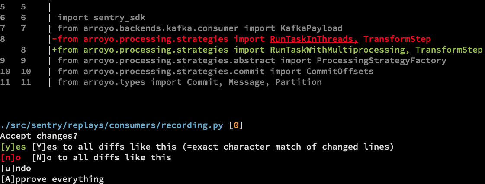

# spacemod

`spacemod` is a text search-and-replace tool optimized towards refactoring
code.

It is very similar to [fastmod](https://github.com/facebookincubator/fastmod),
but with some additional features:

* **Undo stack.** Approved a diff too soon? Hit `[u]ndo` to revert.
* **Yes to all diffs like this.** Auto-approve future diffs with the exact same content.
* **Parenthesis-matching (experimental).** Besides regex, spacemod also
  supports a custom regex-like language that requires less escaping and
  whitespace-handling.
* **Parallelism.** `spacemod` is not quite as CPU-efficient as fastmod, but
  compensates by using background threads to search files while you approve
  diffs.

## Installation

Check [the website](https://untitaker.github.io/spacemod/) for installation options.

## Matching Modes

By default, you use regexes to replace text. See [Matching
modes](./docs/matching.md) for the alternative modes that `spacemod` supports.

## Alternatives

There are many tools like `spacemod`, some of which may suit your needs better. Take a look at [Alternatives](./docs/alternatives.md).

## License

Licensed under `MIT`, see [`./LICENSE`](./LICENSE).

